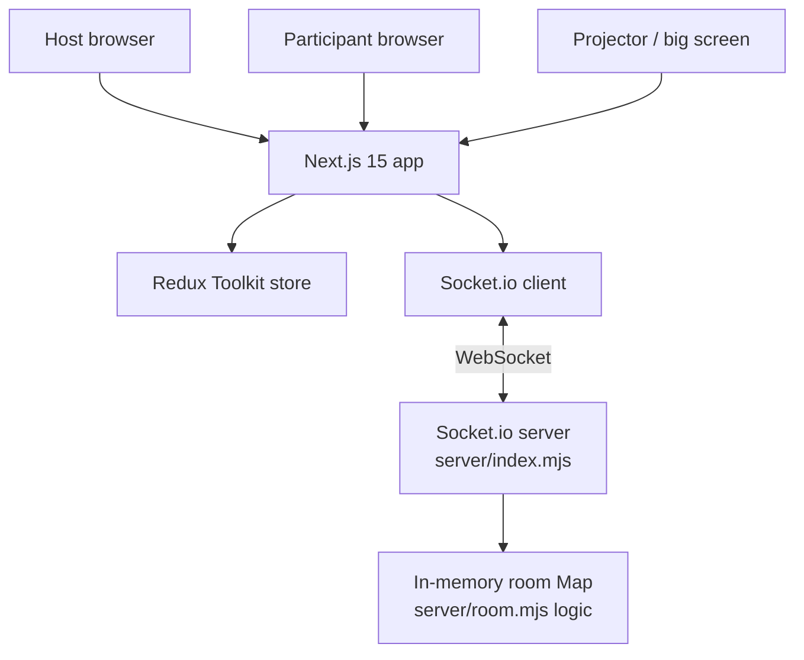
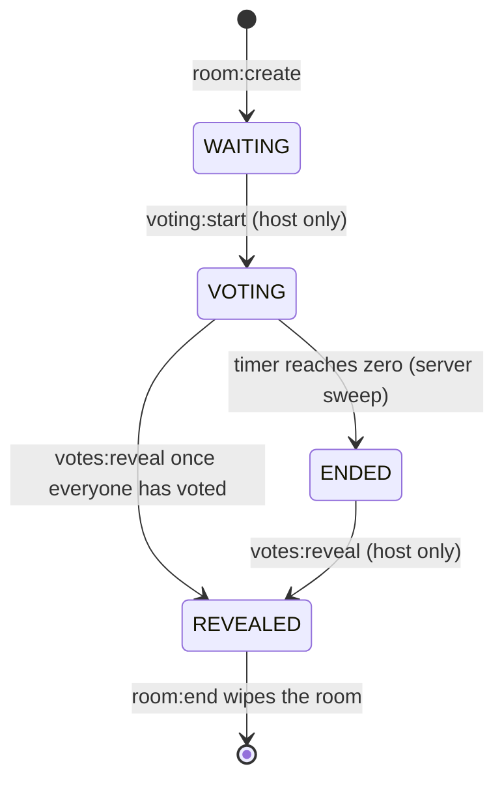
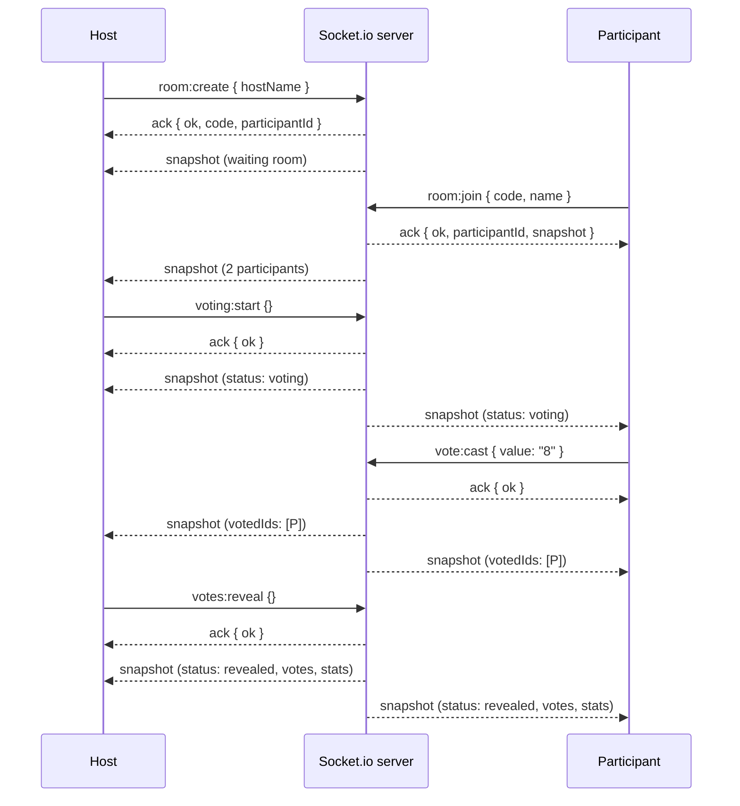

# Architecture

## High-level overview

Reveal is two processes: a **Next.js app** (the UI) and an **in-memory
Socket.io server** (the room state). They talk over WebSockets. There is no
database, no ORM, no persistence of any kind — room state is a plain `Map`
that lives and dies with the realtime server process.

- **The browser** renders Next.js pages. All interactive screens are
  `'use client'` components.
- **Redux** holds the client's view of the room. Components only read Redux;
  they never touch the socket.
- **`RealtimeBridge`** is the only socket consumer: it subscribes to server
  events and dispatches Redux actions. Components *emit* requests through a
  thin `emitAck` helper and let the resulting `snapshot` event update Redux.
- **The server** owns every rule that matters and broadcasts a full
  `snapshot` of the room after every mutation. The client is a dumb projector.

## Server internals

| File             | Responsibility                                                        |
| ---------------- | --------------------------------------------------------------------- |
| `server/index.mjs` | Socket.io wiring, CORS, the `rooms` Map, snapshot broadcasts, the server-side countdown sweep, room expiry sweep, `room:end` teardown |
| `server/room.mjs`  | Pure, unit-tested room logic: `createRoom`, `addParticipant`, `castVote`, `startVoting`, `reveal`, `setTimerSec`, `computeStats`, `buildSnapshot`, `everyoneHasVoted`, disconnect/promotion helpers |

`server/room.mjs` has zero I/O — it is plain functions over plain data, which
is why it can be unit-tested directly (see `tests/unit/server/room.test.ts`).
`server/index.mjs` wires those functions to sockets and owns all timers.

## Room lifecycle

One round per room. The server state machine is:

- **WAITING** — participants join with just a name; nobody can vote; the host
  picks the timer (Off by default) and can start.
- **VOTING** — cards unlock. A vote locks the moment it lands; a second vote
  from the same participant is rejected. Vote *values* never leave the server.
- **ENDED** — the server-side countdown hit zero; voting is closed; only the
  host can reveal (values still hidden).
- **REVEALED** — everyone sees every vote plus statistics; the round is closed
  for good.

### Room expiry

- A room is deleted when the host calls `room:end`.
- Otherwise it lives **10 minutes after the last connected participant left**
  (`ROOM_TTL_MS`, checked every 30 s).
- A server restart clears everything — rooms are memory-only by design.

## Realtime communication

One **snapshot-per-mutation** protocol:

The full event reference lives in [API.md](API.md) and
[REALTIME.md](REALTIME.md).

## State ownership

- **Server state** (`server/room.mjs`): the room object — participants,
  status, votes, timer, stats. This is the source of truth for *rules*.
- **Client state** (Redux): a projection of the last snapshot plus a little
  local UI state (`myVote` optimistic lock, toasts, theme, connection status).
- **Derived state**: `everyoneHasVoted` is computed server-side (it must
  ignore disconnected participants) and shipped in the snapshot; the client
  derives the countdown from the shared `endsAt` timestamp.

## Security & validation

Every important action is validated server-side:

| Action           | Required condition                                        | Rejection      |
| ---------------- | --------------------------------------------------------- | -------------- |
| `voting:start`   | actor is the host **and** status is `WAITING`             | `not_host`, `in_progress` |
| `vote:cast`      | status is `VOTING`, participant has not voted, timer alive | `not_voting`, `already_voted`, `no_value` |
| `votes:reveal`   | actor is the host **and** status is `ENDED`, or `VOTING` + everyone voted | `not_host`, `not_all_voted`, `already_revealed`, `not_started` |
| `room:settings`  | actor is the host **and** status is `WAITING` **and** timer ∈ {null, 10, 15, 30} | `not_host`, `in_progress`, `bad_timer` |
| `participant:remove` | actor is the host, target exists and is not the host | `not_host`, `cannot_remove`, `no_participant` |

The server never trusts the client: the browser's card lock is just UX; the
`Map`-held `hasVoted` flag is the actual lock.

## Privacy

Vote **values** are stored server-side in `room.votes` but only included in a
snapshot when `status === 'revealed'`. Before that, snapshots expose only
`votedIds` — who has voted, never what. This is enforced in `buildSnapshot`
and covered by both the unit tests and the Playwright `vote-privacy` spec.

## Reconnection

- The socket client auto-reconnects (`reconnection: true`).
- On `connect`, `RealtimeBridge` dispatches `connectionChanged('connected')`
  and re-joins the room from the sessionStorage identity via `room:rejoin`.
- A participant who refreshes keeps their seat — and their locked vote — via
  `room:rejoin` (the server restores `status: 'voted'` when a vote exists).
- A participant who leaves the room link and opens a *different* room gets a
  fresh join form (the stale identity is discarded).

## Key implementation notes

- The room code is 5 chars from `ABCDEFGHJKMNPQRSTUVWXYZ23456789` (no
  ambiguous 0/O/1/I/L), generated collision-free against the live room Map.
- The countdown is **server-authoritative**: `startVoting` sets `endsAt`; a
  500 ms server sweep flips `VOTING → ENDED`; clients tick a badge from the
  same `endsAt` so every browser hits zero together.
- `everyoneHasVoted` counts only *connected* participants — someone who
  closed their tab without voting can't deadlock the reveal.
- `scripts/e2e.mjs` is a socket-level E2E suite (89 checks) that exercises the
  real server protocol without a browser; Playwright covers the UI on top.
