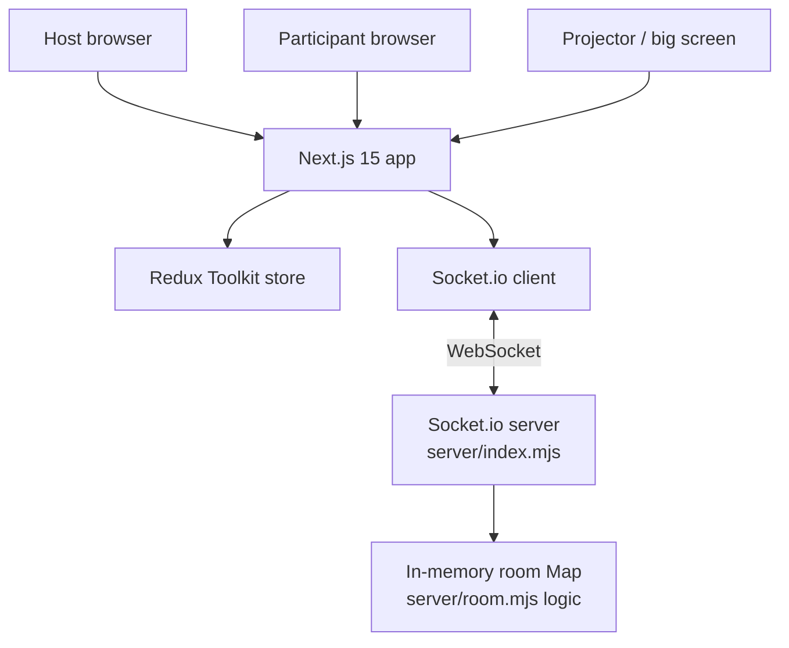
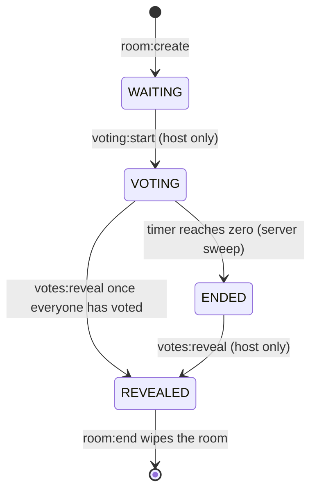
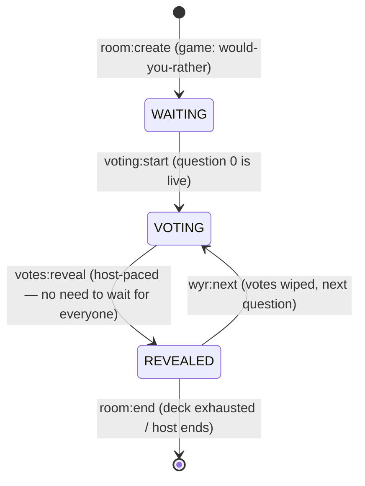
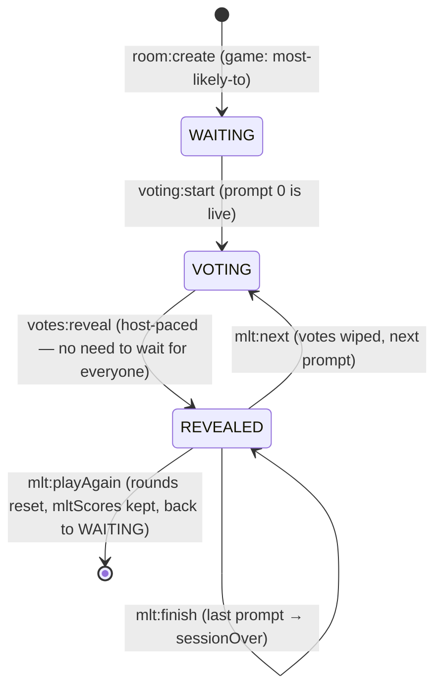
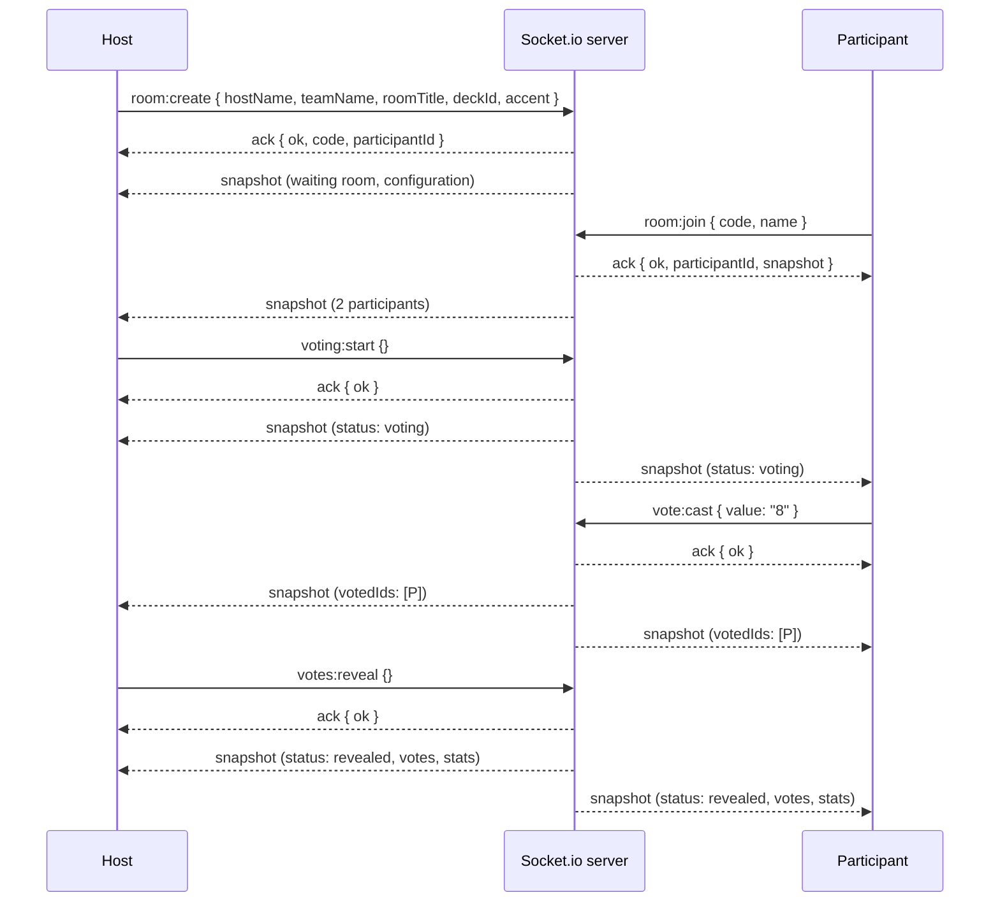

# Architecture

## High-level overview

Reveal is two processes: a **Next.js app** (the UI) and an **in-memory
Socket.io server** (the room state). They talk over WebSockets. There is no
database, no ORM, no persistence of any kind — room state is a plain `Map`
that lives and dies with the realtime server process.

- **The browser** renders Next.js pages. All interactive screens are
  `'use client'` components.
- **Redux** holds the client's view of the room. Components only read Redux;
  they never touch the socket.
- **`RealtimeBridge`** is the only socket consumer: it subscribes to server
  events and dispatches Redux actions. Components *emit* requests through a
  thin `emitAck` helper and let the resulting `snapshot` event update Redux.
- **The server** owns every rule that matters and broadcasts a full
  `snapshot` of the room after every mutation. The client is a dumb projector.

## Server internals

| File             | Responsibility                                                        |
| ---------------- | --------------------------------------------------------------------- |
| `server/index.mjs` | Socket.io wiring, CORS, the `rooms` Map, snapshot broadcasts, the server-side countdown sweep, room expiry sweep, `room:end` teardown |
| `server/room.mjs`  | Pure, unit-tested room logic: `createRoom`, `addParticipant`, `castVote`, `startVoting`, `reveal`, `nextQuestion`, `setTimerSec`, `setRevealMode`, `setLocked`, `calculateConsensus`, `computeStats`, `computeWyrStats`, `normalizeQuestions`, `buildSnapshot`, `everyoneHasVoted`, disconnect/promotion helpers |

`server/room.mjs` has zero I/O — it is plain functions over plain data, which
is why it can be unit-tested directly (see `tests/unit/server/room.test.ts`).
`server/index.mjs` wires those functions to sockets and owns all timers.

## Room configuration

Room customization is **fixed at creation** (`room:create`): the host's name,
an optional team name, an optional room title, the deck, the accent, and the
reveal animation mode. The timer (Off / 10s / 15s / 30s) and the reveal mode
can be changed later in the waiting room by the host. Everything is validated
server-side against the known allow-lists (`KNOWN_DECKS`, `KNOWN_TIMERS`,
`KNOWN_ACCENTS`, `KNOWN_REVEAL_MODES`); unknown values fall back to the
defaults (Fibonacci deck, gold accent, staggered reveal, timer Off).

Rooms also carry a **`game`** field (`planning-poker` | `would-you-rather` |
`most-likely-to`, defaulting to `planning-poker`). Would You Rather rooms
additionally store their **question deck** (`questions`, `{ a, b }` pairs,
clamped to 20, validated by `normalizeQuestions` with a built-in fallback
bank) and an active `questionIndex`. Most Likely To rooms store their
**prompt deck** (`prompts`, strings clamped to 12, validated by
`normalizePrompts`) plus MLT session state: `promptIndex`, `mltScores`
(session totals that survive Play Again), `mltResult` (computed at reveal)
and `sessionOver`. The game field routes the server rules (allowed vote
values, reveal gating) and the client UI branch.

### Decks

The five decks live in `src/lib/decks.ts` — a single configuration array the
voting UI reads through `deckValues(settings)`, so the UI never knows how
decks are defined:

| id                 | values                              | numeric |
| ------------------ | ----------------------------------- | ------- |
| `fibonacci`        | `1 2 3 5 8 13 21`                   | yes     |
| `modifiedFibonacci`| `0 ½ 1 2 3 5 8 13 21`               | yes     |
| `sequential`       | `1 2 3 4 5 6 7 8`                   | yes     |
| `tshirt`           | `XS S M L XL`                       | no      |
| `powersOfTwo`      | `1 2 4 8 16 32`                     | yes     |

The `numeric` flag drives statistics: numeric decks get average/median/range,
T-Shirt rounds get mode + distribution only (a numeric average would be
meaningless). The server validates `deckId` against the same allow-list and
treats `½` as `0.5` in statistics.

## Room lifecycle

One round per room. The server state machine is:

- **WAITING** — participants join with just a name; nobody can vote; the host
  picks the timer (Off by default) and reveal mode, can lock the room, and can
  start. The lobby shows the table configuration (deck, timer, accent) plus a
  QR code of the room URL.
- **VOTING** — cards unlock. A vote locks the moment it lands; a second vote
  from the same participant is rejected. Vote *values* never leave the server.
- **ENDED** — the server-side countdown hit zero; voting is closed; only the
  host can reveal (values still hidden).
- **REVEALED** — everyone sees every vote plus statistics; the round is closed
  for good.

### Would You Rather lifecycle

WYR rooms reuse the same statuses but play **multiple question rounds**: the
first `voting:start` puts question 0 on the table; each `votes:reveal` shows
the A/B split; the host then advances with `wyr:next`.

- **Votes are per question**: `wyr:next` wipes `room.votes` and resets
  `hasVoted`, so the one-pick lock re-arms for the next prompt.
- The host can reveal at **any time** during a question (icebreaker pace) —
  non-voters simply appear as *didn't pick* in the split.
- When the deck is exhausted, `wyr:next` returns `done: true` and the host
  ends the session (`room:end`).

### Most Likely To lifecycle

MLT rooms reuse the same statuses, play **multiple prompt rounds**, and end
with a server-flagged session:

- **Nominations are votes**: MLT reuses the shared `room.votes` map and the
  permanent per-round lock — `vote:cast` validates that the value is a real
  teammate's id (`bad_value` otherwise) and rejects nominating yourself
  (`self_vote`). `mlt:next` wipes `votes` so the lock re-arms.
- **Reveal is host-paced** (icebreaker pace): non-voters appear as *didn't
  nominate*.
- **Scoring** (server-authoritative, at reveal via `computeMltResult`):
  teammates ranked by nominations receive the shared ranking table
  (100/80/60/40/20/10, standard-competition ties, 0 for zero nominations)
  and every voter who nominated a crowned player earns a +20 predictor
  bonus. Totals accumulate in `mltScores`.
- **Session end**: the host calls `mlt:finish` after the final reveal →
  `sessionOver` → every client opens the shared `WinnerModal` (driven by
  `useGameSession`). `mlt:playAgain` resets rounds but **keeps `mltScores`**
  so teams can play several sessions and crown an overall champion.

### Room lock

The host can lock the room at any time (`room:lock` / `room:unlock`). While
locked, **brand-new** participants are refused at join time
(`room_locked`); participants already seated keep their seat, their status,
and any locked vote, and can still rejoin after a refresh. Projector screens
(`role: 'screen'`) are always welcome. Unlocking re-opens the door.

### Room expiry

- A room is deleted when the host calls `room:end`.
- Otherwise it lives **10 minutes after the last connected participant left**
  (`ROOM_TTL_MS`, checked every 30 s).
- A server restart clears everything — rooms are memory-only by design.

## Realtime communication

One **snapshot-per-mutation** protocol:

The full event reference lives in [API.md](API.md) and
[REALTIME.md](REALTIME.md).

## State ownership

- **Server state** (`server/room.mjs`): the room object — participants,
  status, votes, timer, stats, lock flag, configuration. This is the source
  of truth for *rules*.
- **Client state** (Redux): a projection of the last snapshot plus a little
  local UI state (`myVote` optimistic lock, toasts, theme, presentation mode,
  connection status).
- **Derived state**: `everyoneHasVoted` is computed server-side (it must
  ignore disconnected participants) and shipped in the snapshot; the client
  derives the countdown from the shared `endsAt` timestamp. The consensus
  verdict and statistics are computed server-side at reveal
  (`calculateConsensus` + `computeStats`) and shipped in the snapshot.

## Security & validation

Every important action is validated server-side:

| Action           | Required condition                                        | Rejection      |
| ---------------- | --------------------------------------------------------- | -------------- |
| `voting:start`   | actor is the host **and** status is `WAITING`             | `not_host`, `in_progress` |
| `vote:cast`      | status is `VOTING`, participant has not voted, timer alive, value on the room deck (`A`/`B` for WYR; a real teammate's id, not yourself, for MLT) | `not_voting`, `already_voted`, `no_value`, `bad_value`, `self_vote` (MLT) |
| `votes:reveal`   | actor is the host **and** status is `ENDED`, or `VOTING` + everyone voted — for WYR rooms, `VOTING`/`ENDED` alone suffices (host-paced) | `not_host`, `not_all_voted`, `already_revealed`, `not_started` |
| `wyr:next`       | actor is the host, room is a WYR room, status is `REVEALED`/`ENDED` | `not_host`, `not_this_game`, `not_revealed` |
| `room:settings`  | actor is the host **and** status is `WAITING` **and** timer ∈ {null, 10, 15, 30} **and** reveal mode ∈ {normal, staggered, dramatic} | `not_host`, `in_progress`, `bad_timer`, `bad_reveal_mode` |
| `room:lock` / `room:unlock` | actor is the host (any phase)               | `not_host` |
| `participant:remove` | actor is the host, target exists and is not the host | `not_host`, `cannot_remove`, `no_participant` |
| `room:join` / `room:rejoin` | the name is unique in the room (case-insensitive, trimmed) | `name_taken` |
| `room:join` (locked) | the joining id must already be seated          | `room_locked` |

The server never trusts the client: the browser's card lock is just UX; the
`Map`-held `hasVoted` flag is the actual lock. Host controls that are hidden
from participants in the UI are still enforced server-side.

## Privacy

Vote **values** are stored server-side in `room.votes` but only included in a
snapshot when `status === 'revealed'`. Before that, snapshots expose only
`votedIds` — who has voted, never what. This is enforced in `buildSnapshot`
and covered by both the unit tests and the Playwright `vote-privacy` spec.

For Would You Rather, the **question text itself is public** (it is on the
table — the snapshot carries the active `question` once voting starts) but the
**picks** follow the same rule: only `votedIds` until the host reveals. The
same holds for Most Likely To: the **prompt** is public while the
**nominations** (`votes` = who picked whom, plus `mltResult`) only leave the
server at reveal.

## Presence

Each participant has a server-owned `status`:
`connected` (at the table), `voted` (vote locked), or `disconnected` (tab
closed). The UI renders these as *Joined* (waiting room), *Thinking* (voting,
with animated dots), *Voted*, or *Disconnected*. Reconnects restore the seat
and any locked vote via `room:rejoin`, and the client shows a subtle
*Reconnected* toast — a disconnected participant can never bypass the vote
lock because the server state is authoritative.

## Reconnection

- The socket client auto-reconnects (`reconnection: true`).
- On `connect`, `RealtimeBridge` dispatches `connectionChanged('connected')`
  and re-joins the room from the sessionStorage identity via `room:rejoin`.
- A participant who refreshes keeps their seat — and their locked vote — via
  `room:rejoin` (the server restores `status: 'voted'` when a vote exists).
- A participant who leaves the room link and opens a *different* room gets a
  fresh join form (the stale identity is discarded).

## Shared game engine

The two live games (Planning Poker, Would You Rather) each have specialized
state and UIs. **New** competitive games (Most Likely To, trivia, quizzes, …)
are meant to be built on a small set of shared, framework-neutral modules so
they feel like one platform without re-implementing scoring or celebration
UI. See [`games.md`](../games.md) — the master tracker — for the build order:
one game at a time, top to bottom, never deleting entries.

| Module | Purpose |
| ------ | ------- |
| `src/lib/gameTypes.ts` | Shared session vocabulary: `GamePhase`, `PlayerGameStatus`, `GamePlayer` (round + total score), `LeaderboardEntry`, `RoundResult`, `makeGamePlayer` |
| `src/lib/scoring.ts` | Pure scoring engine: default ranking points `100/80/60/40/20/10` (6th+ floors at 10), `calculateRanks` with **standard-competition ties** (scores 100/80/80/60 → ranks 1/2/2/4 — tied players share points, the next rank skips), `awardRankingPoints` (custom tables for fastest-answer/survival/etc.), `buildLeaderboard`, `applyRound` (roundScore replaced, totalScore accumulated, input not mutated), `mergeLeaderboards` (sums boards across games — the building block for a future multi-game **Game Night** session) |
| `src/lib/useAnimatedNumber.ts` | Reduced-motion-aware rAF counter used by every animated score display |
| `src/lib/useGameSession.ts` | Client lifecycle for a competitive game: ranks the server-provided players into a leaderboard, auto-opens the WinnerModal the moment the server marks the session `ended`, and routes Play Again / dismissal. Shared flow only — never game rules |
| `src/components/games/Leaderboard.tsx` | Ranked scoreboard: 🥇/🥈/🥉 medals for the top three (number chips beyond), avatar initials, animated total, "+N" round-delta chips, "you" highlight |
| `src/components/games/WinnerModal.tsx` | End-of-game celebration: confetti burst (reuses `Celebration`), winner banner with animated score, full medal podium, Play Again / Back to Games |

Scoring stays **server-authoritative per game**: the server owns answers,
correctness and awarded points (the client never sends scores). The shared
client-side utilities are pure *derived-state* helpers — deterministic,
unit-tested, and safe for any game to call on the server-received state.

## Key implementation notes

- The room code is 5 chars from `ABCDEFGHJKMNPQRSTUVWXYZ23456789` (no
  ambiguous 0/O/1/I/L), generated collision-free against the live room Map.
- The countdown is **server-authoritative**: `startVoting` sets `endsAt`; a
  500 ms server sweep flips `VOTING → ENDED`; clients tick a badge from the
  same `endsAt` so every browser hits zero together.
- `everyoneHasVoted` counts only *connected* participants — someone who
  closed their tab without voting can't deadlock the reveal.
- The reveal animation is mode-aware (normal / staggered / dramatic) and
  triggered entirely from the shared snapshot; the duration and per-card
  delay are pure CSS.
- Presentation mode is a **UI mode**, not a separate application: it renders
  the same Redux state in a large-font layout. The `/r/<CODE>/screen` route
  is a separate read-only projection that joins as `role: 'screen'`.
- The QR code is generated **locally** with `qrcode.react` (SVG, no external
  service) and encodes the room URL built from the room code.
- Rooms are game-aware: `room.game` routes vote validation (deck cards vs
  `A`/`B` vs teammate ids), reveal gating (everyone-voted vs host-paced) and
  the client UI branch — Planning Poker, Would You Rather and Most Likely To
  share the same `/r/<CODE>` rooms, joins, presence and lifecycle.
- `scripts/e2e.mjs` is a socket-level E2E suite (146 checks) that exercises
  the real server protocol without a browser; Playwright covers the UI on
  top.
