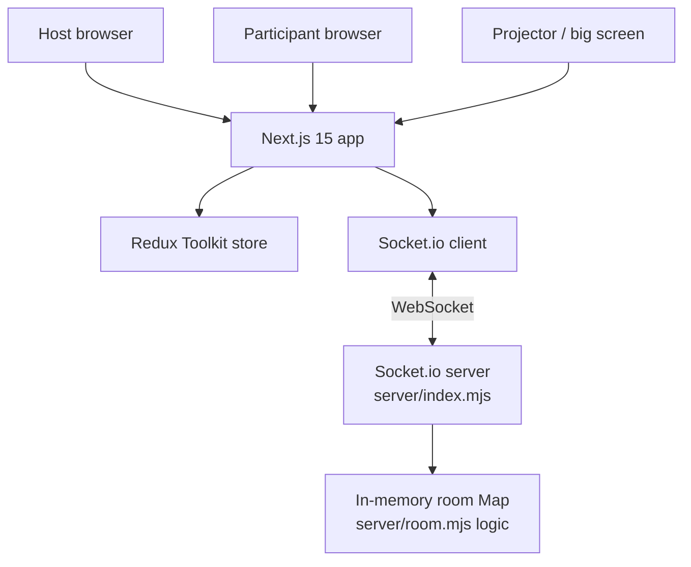
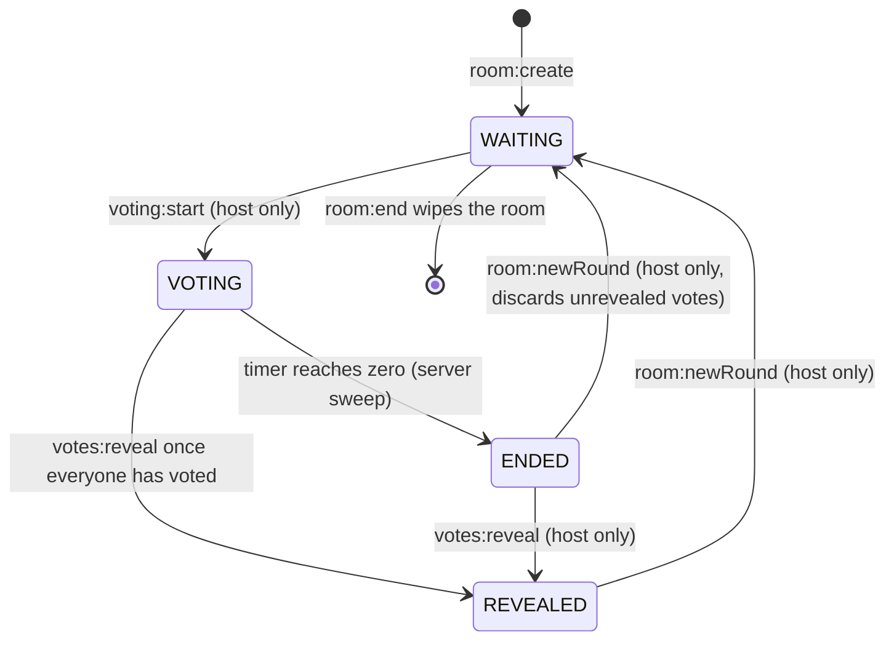
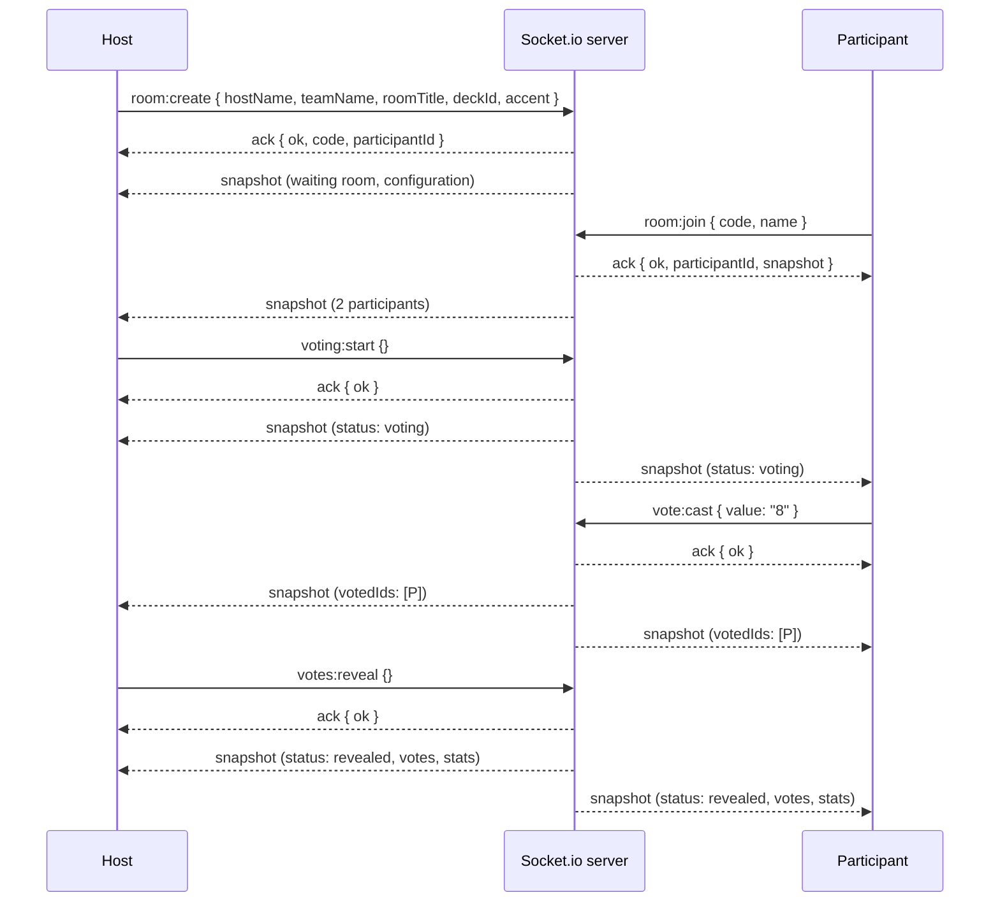

# Architecture

## High-level overview

Reveal is two processes: a **Next.js app** (the UI) and an **in-memory
Socket.io server** (the room state). They talk over WebSockets. There is no
database, no ORM, no persistence of any kind — room state is a plain `Map`
that lives and dies with the realtime server process.

- **The browser** renders Next.js pages. All interactive screens are
  `'use client'` components.
- **Redux** holds the client's view of the room. Components only read Redux;
  they never touch the socket.
- **`RealtimeBridge`** is the only socket consumer: it subscribes to server
  events and dispatches Redux actions. Components *emit* requests through a
  thin `emitAck` helper and let the resulting `snapshot` event update Redux.
- **The server** owns every rule that matters and broadcasts a full
  `snapshot` of the room after every mutation. The client is a dumb projector.

## Server internals

| File             | Responsibility                                                        |
| ---------------- | --------------------------------------------------------------------- |
| `server/index.mjs` | Socket.io wiring, CORS, the `rooms` Map, snapshot broadcasts, the server-side countdown sweep, room expiry sweep, `room:end` teardown |
| `server/room.mjs`  | Pure, unit-tested room logic: `createRoom`, `addParticipant`, `castVote`, `startVoting`, `startNewRound`, `reveal`, `setTimerSec`, `setRevealMode`, `setLocked`, `calculateConsensus`, `computeStats`, `buildSnapshot`, `everyoneHasVoted`, disconnect/promotion helpers |

`server/room.mjs` has zero I/O — it is plain functions over plain data, which
is why it can be unit-tested directly (see `tests/unit/server/room.test.ts`).
`server/index.mjs` wires those functions to sockets and owns all timers.

## Room configuration

Room customization is **fixed at creation** (`room:create`): the host's name,
an optional team name, an optional room title, the deck, the accent, and the
reveal animation mode. The timer (Off / 10s / 15s / 30s) and the reveal mode
can be changed later in the waiting room by the host. Everything is validated
server-side against the known allow-lists (`KNOWN_DECKS`, `KNOWN_TIMERS`,
`KNOWN_ACCENTS`, `KNOWN_REVEAL_MODES`); unknown values fall back to the
defaults (Fibonacci deck, gold accent, staggered reveal, timer Off).

### Decks

The five decks live in `src/lib/decks.ts` — a single configuration array the
voting UI reads through `deckValues(settings)`, so the UI never knows how
decks are defined:

| id                 | values                              | numeric |
| ------------------ | ----------------------------------- | ------- |
| `fibonacci`        | `1 2 3 5 8 13 21`                   | yes     |
| `modifiedFibonacci`| `0 ½ 1 2 3 5 8 13 21`               | yes     |
| `sequential`       | `1 2 3 4 5 6 7 8`                   | yes     |
| `tshirt`           | `XS S M L XL`                       | no      |
| `powersOfTwo`      | `1 2 4 8 16 32`                     | yes     |

The `numeric` flag drives statistics: numeric decks get average/median/range,
T-Shirt rounds get mode + distribution only (a numeric average would be
meaningless). The server validates `deckId` against the same allow-list and
treats `½` as `0.5` in statistics.

## Room lifecycle

A room runs **many rounds** — one per story — while the room itself (code,
host, participants, settings) never changes. The state machine is:

- **WAITING** — participants join with just a name; nobody can vote; the host
  picks the timer (Off by default) and reveal mode, can lock the room, enters
  the optional story details, and can start. The lobby shows the table
  configuration (deck, timer, accent) plus a QR code of the room URL.
- **VOTING** — cards unlock. A vote locks the moment it lands; a second vote
  from the same participant is rejected. Vote *values* never leave the server.
- **ENDED** — the server-side countdown hit zero; voting is closed; only the
  host can reveal (values still hidden) or abandon the round for the next
  story (`room:newRound`).
- **REVEALED** — everyone sees every vote plus statistics. The host can start
  the next story with `room:newRound`: the round payload (votes, stats, story,
  timer) resets and the room returns to WAITING — participants, seats, and
  settings are untouched, and nobody needs a new link.

### New round (`room:newRound`)

Host-only, legal from **REVEALED** or **ENDED**. It resets `status` to
`waiting`, clears `votes`, `stats`, `story` and `timer`, and resets every
participant's `hasVoted`/`status` — the room itself is preserved. The next
`voting:start` assigns the fresh `roundId` (sequential per room: 1, 2, 3, …),
so a vote conceptually belongs to `roomId + roundId + participantId`.

The operation is **idempotent by construction**: while the room is WAITING or
VOTING it is rejected (`in_progress`), so a double-click or a second host tab
can never open two rounds at once. Optional story metadata (`id`, `title`,
`description` — clamped, trimmed) rides along on `voting:start` and is
broadcast to every client in the next snapshot.

### Room lock

The host can lock the room at any time (`room:lock` / `room:unlock`). While
locked, **brand-new** participants are refused at join time
(`room_locked`); participants already seated keep their seat, their status,
and any locked vote, and can still rejoin after a refresh. Projector screens
(`role: 'screen'`) are always welcome. Unlocking re-opens the door.

### Room expiry

- A room is deleted when the host calls `room:end`.
- Otherwise it lives **10 minutes after the last connected participant left**
  (`ROOM_TTL_MS`, checked every 30 s).
- A server restart clears everything — rooms are memory-only by design.

## Realtime communication

One **snapshot-per-mutation** protocol:

The full event reference lives in [API.md](API.md) and
[REALTIME.md](REALTIME.md).

## State ownership

- **Server state** (`server/room.mjs`): the room object — participants,
  status, votes, timer, stats, lock flag, configuration. This is the source
  of truth for *rules*.
- **Client state** (Redux): a projection of the last snapshot plus a little
  local UI state (`myVote` optimistic lock, toasts, presentation mode,
  connection status).
- **Derived state**: `everyoneHasVoted` is computed server-side (it must
  ignore disconnected participants) and shipped in the snapshot; the client
  derives the countdown from the shared `endsAt` timestamp. The consensus
  verdict and statistics are computed server-side at reveal
  (`calculateConsensus` + `computeStats`) and shipped in the snapshot.

## Security & validation

Every important action is validated server-side:

| Action           | Required condition                                        | Rejection      |
| ---------------- | --------------------------------------------------------- | -------------- |
| `voting:start`   | actor is the host **and** status is `WAITING`             | `not_host`, `in_progress` |
| `vote:cast`      | status is `VOTING`, participant has not voted, timer alive, value on the room deck | `not_voting`, `already_voted`, `no_value`, `bad_value` |
| `votes:reveal`   | actor is the host **and** status is `ENDED`, or `VOTING` + everyone voted | `not_host`, `not_all_voted`, `already_revealed`, `not_started` |
| `room:newRound`   | actor is the host **and** status is `REVEALED` or `ENDED` | `not_host`, `in_progress` |
| `room:settings`  | actor is the host **and** status is `WAITING` **and** timer ∈ {null, 10, 15, 30} **and** reveal mode ∈ {normal, staggered, dramatic} | `not_host`, `in_progress`, `bad_timer`, `bad_reveal_mode` |
| `room:lock` / `room:unlock` | actor is the host (any phase)               | `not_host` |
| `participant:remove` | actor is the host, target exists and is not the host | `not_host`, `cannot_remove`, `no_participant` |
| `room:join` (locked) | the joining id must already be seated          | `room_locked` |

The server never trusts the client: the browser's card lock is just UX; the
`Map`-held `hasVoted` flag is the actual lock. Host controls that are hidden
from participants in the UI are still enforced server-side.

## Privacy

Vote **values** are stored server-side in `room.votes` but only included in a
snapshot when `status === 'revealed'`. Before that, snapshots expose only
`votedIds` — who has voted, never what. This is enforced in `buildSnapshot`
and covered by the unit tests (`tests/unit/server/room.test.ts`).

## Presence

Each participant has a server-owned `status`:
`connected` (at the table), `voted` (vote locked), or `disconnected` (tab
closed). The UI renders these as *Joined* (waiting room), *Thinking* (voting,
with animated dots), *Voted*, or *Disconnected*. Reconnects restore the seat
and any locked vote via `room:rejoin`, and the client shows a subtle
*Reconnected* toast — a disconnected participant can never bypass the vote
lock because the server state is authoritative.

## Reconnection

- The socket client auto-reconnects (`reconnection: true`).
- On `connect`, `RealtimeBridge` dispatches `connectionChanged('connected')`
  and re-joins the room from the sessionStorage identity via `room:rejoin`.
- A participant who refreshes keeps their seat — and their locked vote — via
  `room:rejoin` (the server restores `status: 'voted'` when a vote exists).
- A participant who leaves the room link and opens a *different* room gets a
  fresh join form (the stale identity is discarded).

## Key implementation notes

- The room code is 5 chars from `ABCDEFGHJKMNPQRSTUVWXYZ23456789` (no
  ambiguous 0/O/1/I/L), generated collision-free against the live room Map.
- The countdown is **server-authoritative**: `startVoting` sets `endsAt`; a
  500 ms server sweep flips `VOTING → ENDED`; clients tick a badge from the
  same `endsAt` so every browser hits zero together.
- `everyoneHasVoted` counts only *connected* participants — someone who
  closed their tab without voting can't deadlock the reveal.
- The reveal animation is mode-aware (normal / staggered / dramatic) and
  triggered entirely from the shared snapshot; the duration and per-card
  delay are pure CSS.
- Presentation mode is a **UI mode**, not a separate application: it renders
  the same Redux state in a large-font layout. The `/r/<CODE>/screen` route
  is a separate read-only projection that joins as `role: 'screen'`.
- The QR code is generated **locally** with `qrcode.react` (SVG, no external
  service) and encodes the room URL built from the room code.
