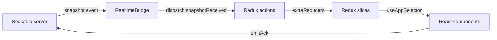

# State management (Redux Toolkit)

The client keeps a projection of the server's room state in a Redux Toolkit
store, plus a small amount of purely-local UI state. One architectural rule
keeps everything simple: **the socket layer dispatches actions; components
read state; the server owns the truth.**

## Data flow



1. A component needs a change → `emitAck('vote:cast', { value })`.
2. The server validates and mutates the room, then broadcasts `snapshot`.
3. `RealtimeBridge` dispatches `snapshotReceived(snapshot)`.
4. Every slice hydrates itself from the snapshot in `extraReducers`.
5. Components re-render from the new state.

The store is configured in `src/store/index.ts` with
`serializableCheck: false` (socket payloads cross the wire as plain data) and
devtools enabled outside production.

## Slices

### `roomSlice` — `state.room`

- **Purpose**: the room's identity and host configuration.
- **State**:
  ```ts
  {
    code: string | null;
    hostId: string | null;
    teamName: string;
    roomTitle: string;                       // optional, set at creation
    createdAt: number;
    settings: { deckId, timerSec, accent, revealMode };
    locked: boolean;                         // host-only join gate
  }
  ```
- **Actions**: `resetRoom` (internal); `snapshotReceived` hydrates everything.
- **Socket events**: `snapshot`.

### `participantsSlice` — `state.participants`

- **Purpose**: the ordered participant list.
- **State**: `{ list: Participant[] }` (sorted by `joinedAt`).
- **Actions**: `resetParticipants`; `snapshotReceived` replaces and sorts.
- **Socket events**: `snapshot`.

### `votingSlice` — `state.voting`

- **Purpose**: the round's phase, deck, and (post-reveal) results.
- **State**:
  ```ts
  {
    phase: 'waiting' | 'voting' | 'ended' | 'revealed';
    deckValues: string[];            // resolved from settings.deckId
    votedIds: string[];              // who has voted (privacy-safe)
    everyoneHasVoted: boolean;
    votes: Record<string, string>;   // only populated after reveal
    stats: Stats | null;             // only populated after reveal
    myVote: string | null;           // optimistic lock for my card
  }
  ```
- **Actions**:
  - `setMyVote(value)` — optimistic card lock the instant I tap;
  - `clearMyVote()` — rollback when the server rejects;
  - `resetVoting()`;
  - `snapshotReceived` hydrates phase/deck/votes/stats from the snapshot
    (the snapshot's `votes`/`stats` are `{}`/`null` until reveal — so the
    slice naturally enforces privacy).
- **Socket events**: `snapshot`.

### `timerSlice` — `state.timer`

- **Purpose**: the synchronized countdown.
- **State**: `{ timer: TimerInfo | null, remaining: number, timesUp: boolean }`
- **Actions**:
  - `tick(remaining)` — local clock derived from the shared `endsAt`;
  - `resetTimer()`;
  - `snapshotReceived` sets/clears the timer and recomputes `remaining`;
  - `timerUp` (dispatched by `RealtimeBridge` once per countdown) marks
    `timesUp`.
- **Socket events**: `snapshot` (plus local `timerUp`).

### `uiSlice` — `state.ui`

- **Purpose**: local UI and identity state.
- **State**:
  ```ts
  {
    theme: 'dark' | 'light' | 'system';
    connection: 'connecting' | 'connected' | 'reconnecting' | 'disconnected';
    myParticipantId: string | null;
    myName: string;
    myRole: 'facilitator' | 'voter';
    joined: boolean;                 // have I joined/rejoined this room
    roomGoneMessage: string | null;
    modals: { endSession: boolean; removeParticipant: boolean };
    toasts: Toast[];                 // capped at 4
    celebrationTick: number;         // replay key for the confetti burst
    presentation: boolean;           // host-only big-screen presentation mode
  }
  ```
- **Actions**: `setTheme`, `setMyIdentity`, `clearMyIdentity`, `openModal`,
  `closeModal`, `pushToast`, `dismissToast`, `triggerCelebration`,
  `setPresentation`.
- **Extra reducers (socket)**: `connectionChanged`, `timerUp` (adds a
  "Time's up!" toast), `roomGone` (stores message, unjoins), `roomEnded`
  (toast), `youRemoved` (clears identity), `snapshotReceived` (syncs my
  role/name, clears stale room-gone notices, flips reconnecting → connected).
- **Socket events**: all of them.

## Cross-cutting actions (`src/store/actions.ts`)

| Action               | Dispatched by        | Consumers                          |
| -------------------- | -------------------- | ---------------------------------- |
| `snapshotReceived`   | RealtimeBridge       | all five slices (extraReducers)    |
| `timerUp`            | RealtimeBridge       | `timerSlice`, `uiSlice`            |
| `roomEnded`          | RealtimeBridge       | `uiSlice` (+ resets)               |
| `roomGone`           | RealtimeBridge/pages | `uiSlice`                          |
| `youRemoved`         | RealtimeBridge       | `uiSlice` (+ resets)               |
| `connectionChanged`  | RealtimeBridge       | `uiSlice`                          |

## Local vs. server state

| State                                  | Owned by   | Why                                                     |
| -------------------------------------- | ---------- | ------------------------------------------------------- |
| Room, participants, votes, timer, stats| **Server** | Rules (lock, privacy, host powers) must not be client-controllable |
| `voting.myVote` (optimistic lock)      | Client     | Instant UI feedback; rolled back on server rejection    |
| `timer.remaining`                      | Client     | Derived locally from the shared `endsAt` to avoid per-second push |
| `ui.presentation`                      | Client     | A presentation *mode* over the same Redux state — not server state |
| Theme, toasts, modals, identity        | Client     | Purely presentational / per-tab                          |

## Selectors

There are no dedicated selector modules — components use inline
`useAppSelector` lambdas (e.g. `s.room.hostId === s.ui.myParticipantId` for
"am I the host", `s.room.settings.accent` for the table skin). With the
slices above, most reads are one level deep and stable, so memoized
selectors are not needed. Timer ticks update only `timerSlice`, so the
participant list does not re-render every second.
