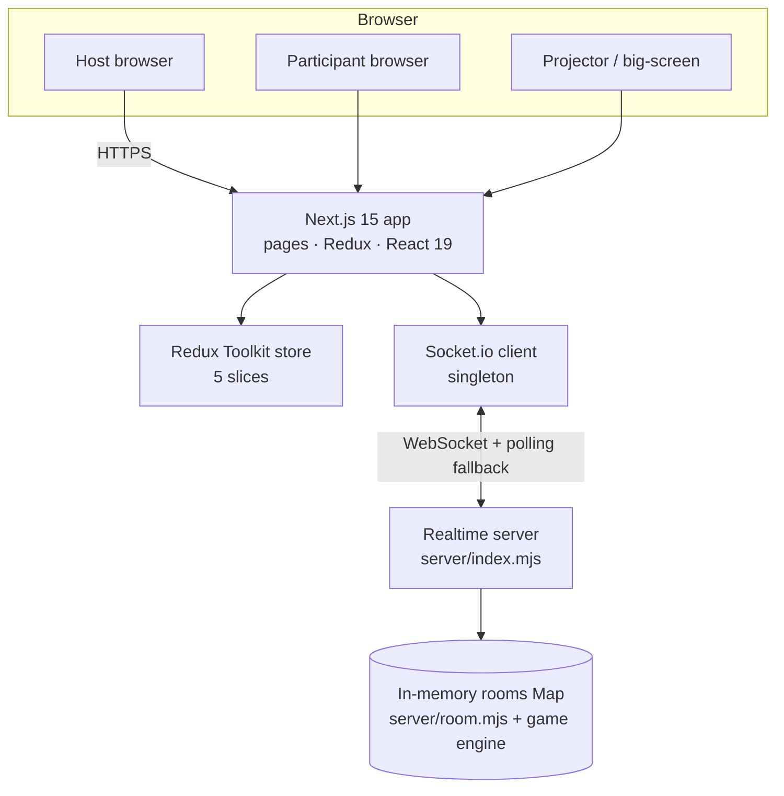
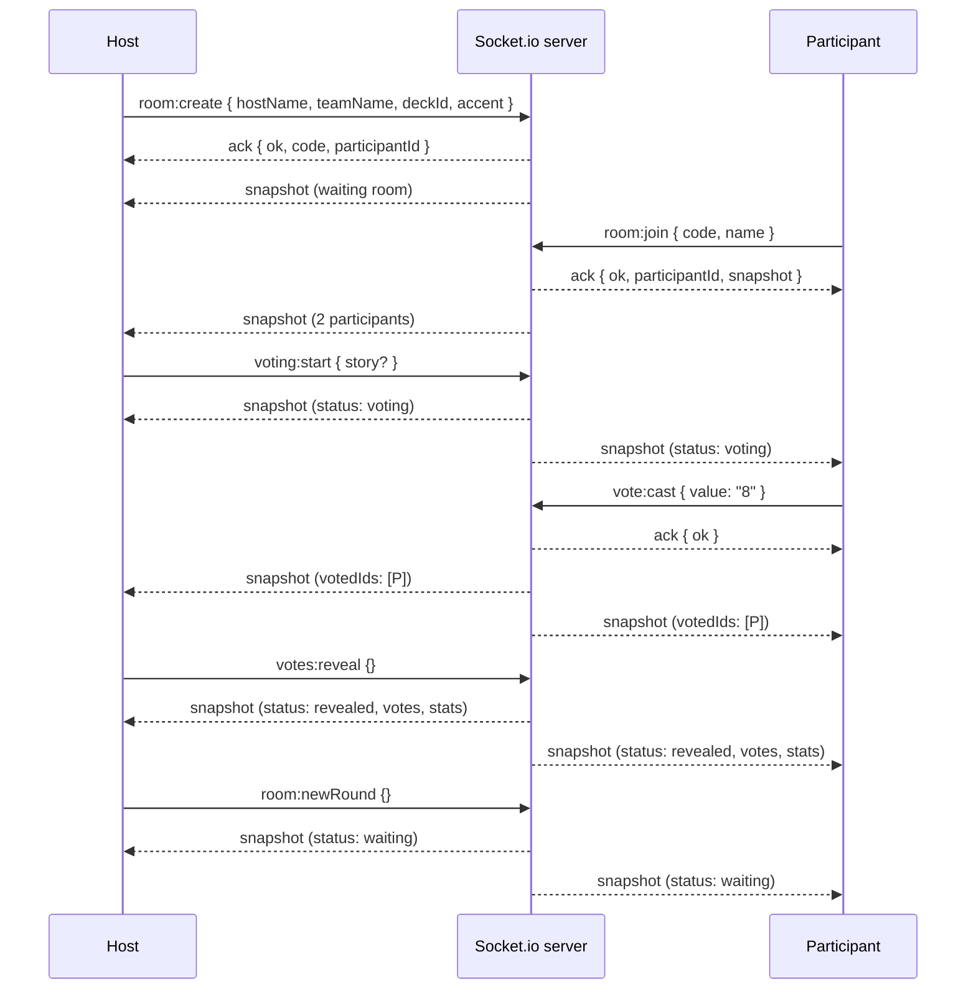
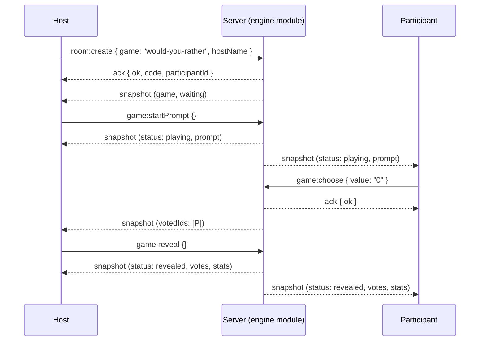
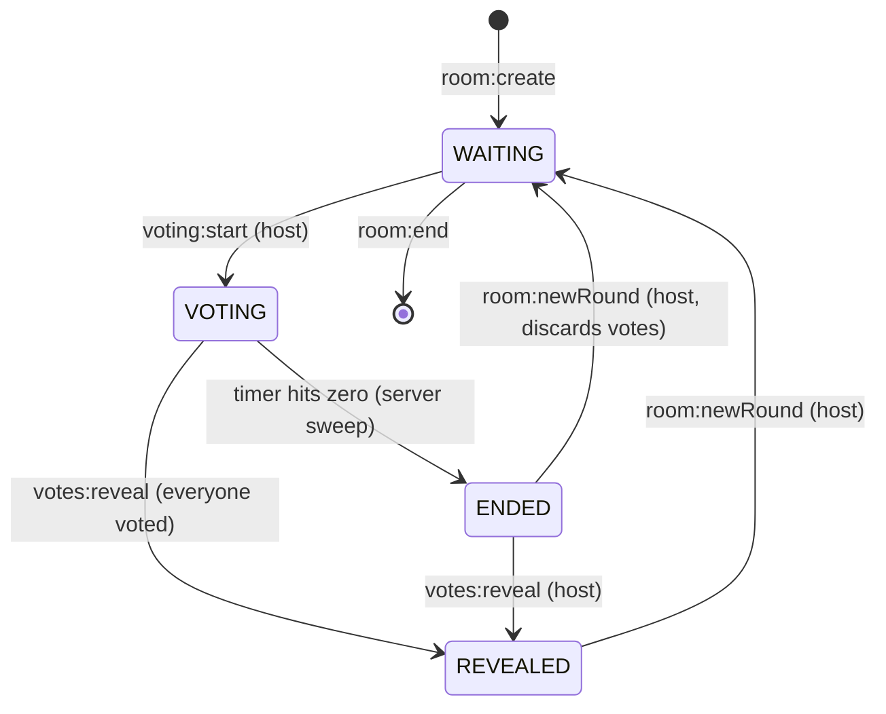
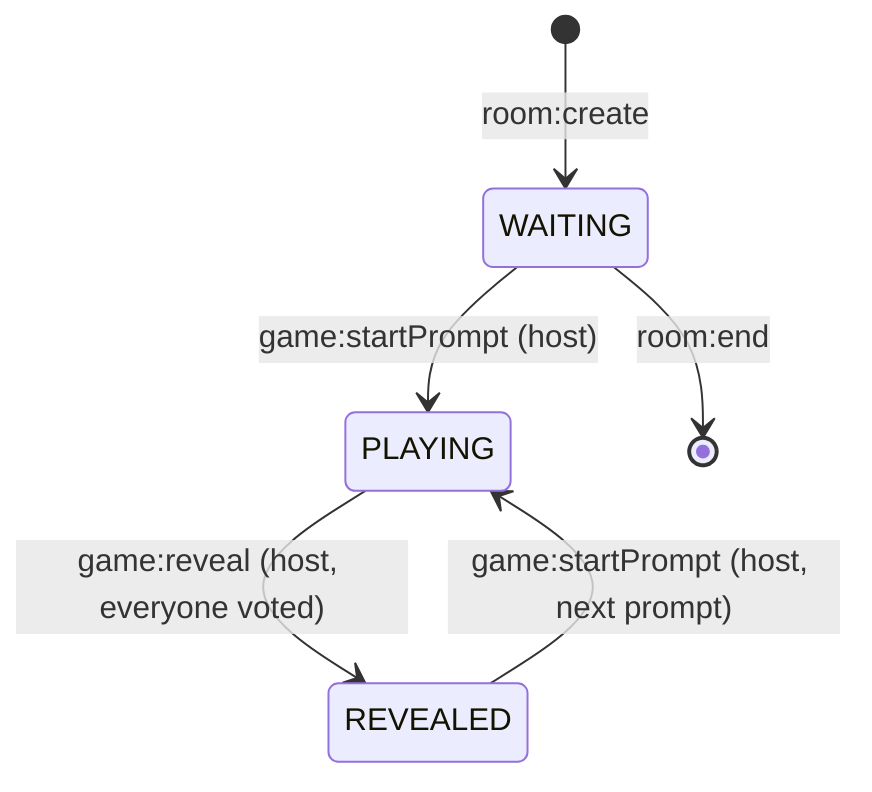
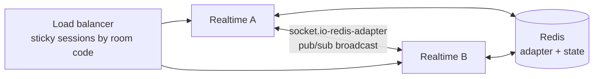

# System Design — Reveal (Real-time Multiplayer Games Platform)

> **One-paragraph summary:** Reveal is a **no-database, real-time multiplayer games platform**.
> Two processes make up the system: a **Next.js 15 app** (UI, React 19, Redux Toolkit) and an
> **in-memory Socket.io server** (room state, game rules). Rooms live in a plain `Map` on the
> realtime process and vanish when empty — deliberately. The server owns every rule
> (vote lock, reveal conditions, timer, privacy) and broadcasts a full room `snapshot`
> after every mutation; clients are dumb projectors that hydrate Redux from it. 60+ games
> run on one generic game engine driven by JSON prompt banks.

---

## 1. Goals, non-goals & constraints

### Goals
- Create a game room in seconds, share a link, play with zero signup.
- **Ephemeral by design** — no accounts, no database, no history. Rooms vanish when empty.
- Server-authoritative rules: a client can never bypass a vote lock, reveal early, or invent a card value.
- **Privacy**: vote *values* never leave the server until the host reveals the round.
- One generic **game engine** so adding a game is a JSON file + registry row, not a new page.

### Non-goals (today)
- No persistence, no auth, no billing, no cross-session history.
- No horizontal scaling of the realtime server (deliberately single-instance — see §13).
- No serverless hosting for the realtime server (needs a persistent process).

### Hard constraints
- Room state lives **only in memory** — a restart wipes every room (a product decision).
- The realtime server is **one process**; every participant of a room must reach that process.
- `NEXT_PUBLIC_SOCKET_URL` is baked into the client bundle **at build time**.

---

## 2. High-level architecture



- **Browser** renders Next.js pages. All interactive screens are `'use client'`.
- **Redux** holds the client's projection of the room. Components read Redux only; they never touch the socket directly.
- **`RealtimeBridge`** is the single socket consumer: it subscribes to server events and dispatches Redux actions.
- **The server** owns all rules and broadcasts a full `snapshot` after every mutation.

### The two processes

| Process | Tech | Port | Responsibility |
| --- | --- | --- | --- |
| App | Next.js 15 (App Router, React 19, TS strict) | 3000 (default) | Pages, Redux, Socket.io client, catalog, QR, theming |
| Realtime | Node + Socket.io 4 (in-memory) | 3001 (default) | Room state, game logic, timers, expiry, broadcasts |

They talk **only through the browser** (WebSocket); there is no server-to-server call.

---

## 3. Technology stack & concepts already in use

| Layer | Technology | Concept it demonstrates |
| --- | --- | --- |
| Framework | Next.js 15 App Router, React 19 | SSR/CSR hybrid, App Router |
| Language | TypeScript 5 (strict) on the client; ES modules (`.mjs`) on the server | Type safety; JSDoc-typed server logic |
| Client state | Redux Toolkit 2 + react-redux 9 | Single-direction data flow, optimistic UI with rollback |
| Realtime | Socket.io 4 (client + server), `websocket` + `polling` fallback | WebSocket with automatic fallback, rooms/channels |
| Sync protocol | Full **snapshot-per-mutation** broadcasts | State-transfer sync — no patch events, no drift |
| Forms | react-hook-form + yup | Client validation |
| Styling | SCSS modules, design tokens, CSS custom properties (accents) | Theming via CSS variables |
| QR | qrcode.react (local SVG) | No external share service |
| Identity | `sessionStorage` per game (`reveal:identity:*`) | Tab-scoped anonymous identity |
| Collision-free codes | 5 chars from `ABCDEFGHJKMNPQRSTUVWXYZ23456789` (31²… 31⁵ ≈ 28.6M combos), checked against live rooms | Unambiguous alphabet, O(1) lookup |
| Garbage collection | Room TTL sweep (`ROOM_TTL_MS` = 10 min, every 30 s) | TTL-based reclamation of ephemeral state |
| Server-authoritative timer | `endsAt` timestamp + 500 ms sweep; clients tick the same `endsAt` | Deterministic shared clock semantics |
| Validation | Allow-list sets on the server (`KNOWN_DECKS`, `KNOWN_TIMERS`, …) | Defense-in-depth — never trust the client |
| Privacy | `buildSnapshot` strips vote values unless `status === 'revealed'` | Server-side information hiding |
| Resilience | Socket reconnection (600 ms → 4 s backoff), `room:rejoin`, host promotion | Reconnect-safe session continuity |
| Config | `.env`-driven (`SOCKET_PORT`, `SOCKET_ORIGIN`, `NEXT_PUBLIC_SOCKET_URL`) | Twelve-factor style config |
| Infra-as-code | `render.yaml` blueprint | Declarative deployment |
| Health check | `GET /` on the realtime server returns 200 text banner | Readiness probe |
| Testing | Vitest (unit + components), Playwright (browser E2E), `scripts/e2e.mjs` (socket-level suite) | Layered test strategy (see §11) |
| Game engine | `server/games/engine.mjs` + `registry.mjs` + `data/*.json` | Config-driven generic engine (kinds: `options`, `teammate`, `quiz`, `estimate`) |

---

## 4. Component breakdown

### 4.1 Client (Next.js + Redux)

```
src/
├── app/                     # Routes: /, /games, /games/[gameId], /create, /r/[roomCode], /r/[roomCode]/screen
│   ├── games/[gameId]/      # Live engine games → <GameRoom/>; others → ComingSoon placeholder
│   ├── create/              # Planning poker (dedicated page)
│   └── r/[roomCode]/        # Room page + read-only /screen projection
├── components/
│   ├── RealtimeBridge.tsx   # Socket → Redux bridge (only socket consumer)
│   ├── game/GameRoom.tsx    # ONE shared room component for all 60+ engine games
│   └── room/, games/, modals/
├── lib/                     # socket, identity, decks, games (catalog), gameConfig, gameEngine, types, errors
├── store/                   # RTK store + 5 slices (room, participants, voting, timer, ui) + actions
└── styles/                  # global SCSS, tokens, mixins, accent presets
```

Key client concepts:
- **Singleton socket** (`src/lib/socket.ts`) with `emitAck()` — a promise wrapper with an 8 s timeout so a dead server can't hang the UI.
- **Optimistic voting** — `myVote` is set instantly, rolled back if the ack rejects.
- **Per-game identity** (`sessionStorage`, keyed by game id) so different games in one tab never collide.
- **`RealtimeBridge`** — dedupes cold-load rejoin vs. reconnect rejoin via a `rejoinPending` flag.

### 4.2 Realtime server

| File | Responsibility |
| --- | --- |
| `server/index.mjs` | Socket.io wiring, CORS, `rooms` Map, snapshot broadcasts, 500 ms timer sweep, 30 s expiry sweep, generic game-event wiring |
| `server/room.mjs` | **Pure, unit-tested** room logic: `createRoom`, `castVote`, `startVoting`, `reveal`, `computeStats`, `calculateConsensus`, `buildSnapshot`, disconnect/promotion helpers |
| `server/games/engine.mjs` | Generic game engine: one state machine, four kinds of rounds (`options` / `teammate` / `quiz` / `estimate`), kind-specific validation + reveal math |
| `server/games/registry.mjs` | Single source of truth mapping game id → kind → cast event → JSON data file; asserts the file's `kind` at boot |
| `server/games/data/*.json` | 60+ prompt/question banks (no code changes to ship a game) |

`server/room.mjs` and `server/games/*` have **zero I/O** — plain functions over plain data — which is why unit tests drive them directly without sockets.

### 4.3 Data model (in memory only)

```ts
Room {
  code: string            // 5-char unambiguous alphabet
  roundId: number         // increments per round — votes belong to roomId + roundId + participantId
  hostId: string | null
  teamName, roomTitle: string
  settings: { deckId, timerSec, accent, revealMode }   // validated allow-lists
  locked: boolean
  participants: Map<id, Participant>   // status: connected | voted | disconnected
  status: 'waiting' | 'voting' | 'ended' | 'revealed'
  votes: Record<participantId, string> // values NEVER leave the server pre-reveal
  stats: RoomStats | null              // computed at reveal (avg/median/range/consensus)
  story: { id, title, description } | null
  timer: { durationSec, endsAt } | null
  emptySince: number | null            // expiry clock
}
```

Game rooms (engine) are the same shape with `status: waiting | playing | revealed` and
kind-specific `prompt` / `votes` / `stats`.

---

## 5. Core flows (sequence diagrams)

### 5.1 Planning poker — create → vote → reveal



### 5.2 Engine games (Most Likely To, Would You Rather, quizzes, …)



---

## 6. State machines

### 6.1 Planning poker (per room, multi-round)



### 6.2 Engine games (per room)



Both machines are **server-enforced and idempotent**: starting a round while one is live is
rejected (`in_progress`), so double-clicks and racing tabs can't corrupt state.

---

## 7. Realtime protocol & sync strategy

- **Snapshot-per-mutation**: after every successful mutation the server emits one full
  `snapshot` to the room channel. Clients replace their Redux slices from it. No incremental
  patches → no drift, simple reasoning, easy testing.
- **Server authority**: vote lock (`hasVoted`), reveal legality, timer expiry, deck validation,
  lock/unlock, host-only actions — all enforced in `server/room.mjs` / the engine modules.
- **Privacy by construction**: `buildSnapshot` / `buildGameSnapshot` only include `votes` when
  `status === 'revealed'`; quiz/estimate answers are stripped from `prompt` pre-reveal.
- **Timers**: the server owns `endsAt`; a 500 ms sweep flips `VOTING → ENDED`. Every client
  ticks the same `endsAt` so all browsers hit zero together (`RealtimeBridge` interval, fires
  `timerUp` once per countdown keyed by `durationSec:endsAt`).
- **Presence**: participants carry `connected | voted | disconnected`; reconnects restore seat
  + locked vote via `room:rejoin`; host promotion picks the longest-connected participant if
  the host vanishes; `everyoneHasVoted` ignores disconnected players so a closed tab can't
  deadlock a reveal.

### Socket events (reference)

| Event | Actor | Purpose |
| --- | --- | --- |
| `room:create` | anyone | Create room (poker or `game`), seat host |
| `room:join` / `room:rejoin` | anyone | Take a seat / reclaim seat after refresh; `role:'screen'` = projector |
| `voting:start` | host | Start poker round (optional story payload) |
| `vote:cast` / `vote:skip` | voter / host | Lock a vote (or host skips) — once, while VOTING |
| `votes:reveal` | host | Reveal values + stats |
| `room:newRound` | host | Next story, same room |
| `game:startPrompt` | host | Start engine-game round |
| `game:pick` / `game:choose` / `game:answer` / `game:guess` | voter | Engine-game cast (event per kind) |
| `game:reveal` | host | Reveal engine-game round |
| `room:settings` | host | Timer (10/15/30/off) + reveal mode (waiting room) |
| `room:lock` / `room:unlock` | host | Refuse new joiners while locked |
| `participant:remove` | host | Kick a participant (emits `you:removed` to them) |
| `room:end` | host | Tear down the room (emits `room:ended`) |
| `snapshot` | server → all | Full room state after every mutation |

---

## 8. Security & validation model

- **Never trust the client**: every important action is validated server-side against
  allow-lists; unknown values fall back to defaults (e.g. `bad_value`, `bad_timer`).
- **Host-only actions** check `actorId === room.hostId` server-side even when the UI hides the buttons.
- **Locked rooms** refuse brand-new joiners (`room_locked`) but admit seated participants and screens.
- **CORS** is restricted to `SOCKET_ORIGIN` (comma-separated allow-list).
- **Input clamping**: names (32), team name (40), room title (60), story fields (32/80/200) —
  trimmed and sliced server-side.
- **Payload cap**: `maxHttpBufferSize: 64 * 1024` on the Socket.io server.
- **Vote values are validated against the room's deck** (`DECK_VALUES`) — a client can never
  invent a card. Engine games validate per kind (participant ids, option indexes, numeric guesses).

---

## 9. Reliability & failure handling (implemented)

| Failure | Handling |
| --- | --- |
| Client loses connection | Auto-reconnect (600 ms → 4 s backoff, infinite attempts); `room:rejoin` restores seat + vote status; "Reconnected" toast |
| Tab refresh mid-round | `sessionStorage` identity + `room:rejoin` keeps the seat and locked vote |
| Host disconnects | Longest-connected participant is promoted to host (state preserved) |
| Participant leaves without voting | Status `disconnected`; `everyoneHasVoted` ignores them — reveal can't be deadlocked |
| Server restart | All rooms gone — **by design** (documented, no recovery path) |
| Empty room lingers | Expiry sweep deletes rooms empty for 10 min (`ROOM_TTL_MS`) |
| Timer race (vote lands after zero) | Server flips room to `ended` and rejects the vote (`timerEnded`) |
| Double-click / racing tabs | Idempotent transitions (`in_progress`), permanent vote lock (`already_voted`) |
| Dead server / no ack | `emitAck` 8 s timeout surfaces a friendly error instead of hanging |

---

## 10. Deployment architecture (current)

```
Internet
   │
   ├── Vercel (Next.js app)  ────────── serves pages, static assets, client bundle
   │
   └── Render (realtime server)  ────── node server/index.mjs, WebSocket upgrades forwarded
        │
        └── In-memory rooms Map
```

- `render.yaml` blueprint: single web service, `npm ci` + `node server/index.mjs`, health check on `/`.
- `SOCKET_ORIGIN` = app origin(s) (CORS allow-list). `NEXT_PUBLIC_SOCKET_URL` baked at build time.
- Proxy must forward WebSocket upgrades (Nginx: `proxy_http_version 1.1`, `Upgrade`/`Connection` headers).
- Free-tier caveat: Render free services sleep after ~15 min idle → cold start may exceed the
  client's 7 s connect timeout. Use the paid plan for a reliable demo.

---

## 11. Testing strategy

| Layer | Tool | Covers |
| --- | --- | --- |
| Unit | Vitest (jsdom) | `server/room.mjs` state machine, engine kinds, stats/consensus math, Redux slices, lib helpers |
| Component | Vitest + Testing Library | Room components, GameCatalog, forms |
| Socket E2E | `scripts/e2e.mjs` (~150 checks) | Real server protocol: ack rejections (`already_voted`, `not_host`, `not_all_voted`, `room_locked`), privacy |
| Browser E2E | Playwright (real Next + realtime servers, isolated `.next-e2e` dist) | Multi-context multiplayer flows, vote privacy spec |
| Load | ❌ not implemented | See `optimization.md` (k6 / artillery) |

---

## 12. Capacity math (today's design)

- **Rooms**: room state is small (~1–5 KB: code, config, participants, votes). One process
  comfortably holds **thousands of concurrent rooms**; memory grows with *active* rooms only.
- **Connections**: one Node process realistically sustains **~2–5k concurrent WebSockets**
  comfortably, up to ~10k with tuning (ulimit, `--max-old-space-size`, backpressure care).
- **Room code space**: 31⁵ ≈ **28.6 M** codes — collision check against the live Map is O(1).
- **Sweeps**: 500 ms timer sweep + 30 s expiry sweep are O(active rooms) — trivial at thousands of rooms.
- **Broadcasts**: each vote → one snapshot to the room channel (~1–6 KB for a 20-person room).
  With 500 active rooms voting once per second ≈ a few MB/s worst case — easily within one process.

> **Conclusion:** the current single-instance design is fine for hundreds of simultaneous rooms
> (a few thousand users). **10k+ concurrent users is the point where §13 kicks in.**

---

## 13. Scenarios & solutions (system-design questions)

### Scenario A — "10,000 users visit the website at once" (traffic spike)

**What happens today**
- The **catalog/homepage** is static data (`src/lib/games.ts`) rendered by Next.js on Vercel —
  serverless scaling + CDN absorb the spike automatically. Static assets (JS/CSS/SCSS) are
  cached by Vercel's CDN. No database is touched, so there's no DB bottleneck.
- The **realtime server** is the constraint: 10k users in rooms = up to ~2–3k concurrent
  WebSocket connections on one process (rooms of ~4–5 people). One Node process can hold this
  but is a single point of failure and a CPU/event-loop risk during bursts (e.g. a reveal
  storm where hundreds of rooms broadcast at once).

**Solution (now)**
1. **Static-first front end**: keep the catalog static / SSG so page views never hit the
   realtime server. Add `Cache-Control` headers (Vercel does this for statically rendered pages).
2. **Connection tuning on the realtime box**: raise `ulimit -n` (file descriptors),
   `NODE_OPTIONS=--max-old-space-size=4096`, and monitor the event loop.
3. **Room creation burst protection**: rate-limit `room:create` per socket/IP (see Scenario E)
   so a script can't open 10k empty rooms (each would otherwise live 10 min in memory).

**Solution (when 10k concurrent users is a real target) — see Scenario B**
- Horizontal scaling with a Redis adapter + sticky sessions, plus a CDN in front of the app
  and load balancers in front of the realtime fleet. Target **2–4 realtime instances** for 10k users.

---

### Scenario B — Horizontal scaling & load balancing of the realtime server

**The core problem:** rooms live in one process's memory, and Socket.io broadcasts are
in-process (`io.to(room.code)`). Two instances would each hold *different* rooms — a
participant connecting to instance B couldn't find the room created on instance A.

**Solution — the standard WebSocket scaling stack:**



1. **Redis pub/sub adapter** — `@socket.io/redis-adapter` (or `@socket.io/redis-streams-adapter`
   for large fan-out). A vote on instance A is published to Redis and re-broadcast to the room's
   sockets on instance B. The client code (event names, snapshot payloads) stays unchanged.
2. **Sticky sessions** — route every socket of one room to the same instance. Options:
   - Nginx `ip_hash` / HAProxy `balance hdr` on the room code cookie;
   - **Consistent hashing on the room code** in a custom LB (the ideal: all sockets for code
     `ABCDE` → instance A, so even the *state* stays local and Redis is only a fallback).
3. **Move room state to Redis (optional, for crash-tolerance)** — the room Map becomes a Redis
   hash per room. Trade-off: this breaks the "ephemeral by design" story slightly — decide
   whether rooms should survive a node crash (recommended: keep ephemeral, just shard them).
4. **Stateless front end** — Next.js stays on Vercel (serverless); it never holds room state.

**Load balancer checklist (any path):**
- Forward `Upgrade: websocket` + `Connection: upgrade` headers.
- `proxy_read_timeout` long enough for idle sockets (Socket.io sends pings every ~25 s).
- Health checks against `GET /` on the realtime server; drain mode for rolling deploys.

---

### Scenario C — Caching (what's cacheable, what's not)

| What | Cacheable? | How |
| --- | --- | --- |
| Catalog pages, game list, docs | ✅ Yes | Next.js static rendering + CDN cache headers (`s-maxage`, `stale-while-revalidate`) |
| Static assets (JS/CSS/images/fonts) | ✅ Yes | Vercel CDN, hashed filenames → immutable caching |
| Game config (`src/lib/gameConfig.ts`) | ✅ Yes | Bundled into the client at build time — already "cached" |
| Prompt banks (`server/games/data/*.json`) | ✅ Yes | Loaded once into memory at boot (already a cache) |
| Room snapshots | ⚠️ Careful | Snapshot is *per-room, per-mutation* state — not globally cacheable. A CDN cache of snapshots would leak private vote data and go stale. Keep it real-time. |
| Redis-cached room state | ✅ (future) | Only if moving state out of process memory (Scenario B) |

**Caching rules of thumb for this app:**
- Never cache anything containing vote values (`votes`, `stats`, quiz answers) — privacy (§8).
- Use `Cache-Control: private, no-store` on any page that embeds room state.
- Client-side: React/Redux already memoizes renders; the catalog filter state is local.

---

### Scenario D — CDN & static serving

- **Vercel** already serves the Next.js app through its edge CDN — set
  `Cache-Control` correctly on static routes and you get global edge caching for free.
- **Not cacheable at the edge:** the `/r/[roomCode]` room page and `/games/[gameId]?room=...`
  pages are dynamic (client-side sockets) — they render an empty shell + JS; the *real* state
  comes over WebSocket, which cannot be CDN-cached (by design).
- Optional: Cloudflare in front of both the app and the realtime server for DDoS
  protection, TLS, and WebSocket proxying.

---

### Scenario E — Abuse, rate limiting & DDoS

**Implemented today:** CORS allow-list, 64 KB payload cap, input clamping, server-side
validation, room lock.

**Missing (add before public launch at scale):**
1. **Rate limiting on the socket layer** — `@socket.io/rate-limiter` or a manual token
   bucket in a Socket.io middleware:
   - `room:create` — e.g. 5 per minute per IP (blocks room-creation floods);
   - `vote:cast` / `game:*` — e.g. 10/s per socket (blocks vote spam);
   - `room:join` — e.g. 30/min per IP (blocks join floods).
2. **HTTP rate limiting** on any REST surface (currently only the health banner — trivial, but
   add it if REST endpoints appear).
3. **Connection caps per IP** — limit concurrent sockets per IP (Nginx `limit_conn` or in-app).
4. **Trust proxy** — set `trust proxy` so `socket.handshake.address` is real behind an LB;
   otherwise rate limits key on the LB's IP.
5. **CDN/WAF** (Cloudflare) in front of the app for volumetric DDoS.

---

### Scenario F — Realtime server crash / restart / deploy

**Impact today:** every room is lost instantly (by design). There is no recovery path and the
docs say so.

**Mitigations (in order of effort):**
1. **Graceful shutdown** — handle `SIGTERM`/`SIGINT`: stop accepting new connections, broadcast
   a "server is going down" notice (`room:ended`-style), drain sockets, then exit. Cost: hours.
2. **Process manager** — systemd/pm2 with `Restart=always` so a crash auto-restarts
   (rooms still lost, but downtime is seconds, not manual).
3. **Automated deploys** — Render blueprint already auto-deploys; add a CI pipeline
   (`optimization.md`) so deploys are tested, and schedule them for low-traffic windows.
4. **Room state in Redis** — only if product wants rooms to survive restarts (changes the
   product's ephemerality promise — needs a product decision).

---

### Scenario G — Large rooms / broadcast fan-out

A 50-person room gets one snapshot per mutation. A reveal of 200 rooms at once = 200 ×
(50 × ~3 KB) ≈ 30 MB in one burst — fine for one process, but the moment to watch is
**event-loop blocking** from JSON.stringify of big snapshots.

**Solutions:**
1. **Compression** — Socket.io enables per-message deflate (verify for the installed engine
   version). ~5–10× smaller payloads at a small CPU cost.
2. **Snapshot trimming** — participants carry per-round fields (`hasVoted`, `skipped`) that
   could be derived client-side; shipping only `votedIds` + names keeps payloads flat.
3. **Coalescing (future, only if profiling demands it)** — batch rapid mutations into one
   snapshot per tick (e.g. 100 ms) instead of one per event. Only worth it past ~10k users.
4. **Cap room size** (product decision) — README advertises "3–20 players"; enforce a server cap
   (e.g. 40) to bound snapshot size and broadcast cost.

---

### Scenario H — Observability: monitoring, metrics & logging

**Implemented:** a health endpoint (`GET /` → 200). **That's it.**

**Recommended stack (all in `optimization.md` plan):**
| Need | Tool |
| --- | --- |
| Metrics | Prometheus client (`prom-client`) + `/metrics` endpoint; Grafana dashboards |
| Key metrics | connected sockets, rooms count, snapshots/s, broadcast bytes/s, event-loop lag, vote latency p95, memory |
| Structured logs | pino (JSON, request/socket-scoped), shipped to a log sink |
| Error tracking | Sentry (client + server) |
| Uptime | Render built-in health checks + UptimeRobot/StatusCake |
| Load testing | k6 or artillery: N sockets per room × M rooms, assert p95 broadcast latency < 200 ms |
| Alerting | Grafana/Alertmanager on: sockets > threshold, event-loop lag > 500 ms, memory > 80% |

---

### Scenario I — Security hardening (checklist)

- [x] CORS allow-list (`SOCKET_ORIGIN`)
- [x] Server-side validation of every action + allow-lists
- [x] Payload size cap (64 KB)
- [x] Input length clamping
- [x] Vote privacy (values server-side until reveal)
- [ ] **Rate limiting** (Scenario E)
- [ ] **Security headers** — CSP, `X-Content-Type-Options`, `Referrer-Policy` (Next can set via
      `headers()` in `next.config`); add CSP that allows the socket origin (ws: / wss:).
- [ ] **`trust proxy`** configuration behind a proxy/LB
- [ ] **Dependency scanning** — `npm audit` in CI; Dependabot/Renovate
- [ ] **Secrets hygiene** — env vars already gitignored; rotate if ever committed
- [ ] **DoS on room codes** — code space is 28.6 M; rate-limited creation (Scenario E) closes
      the enumeration hole

---

### Scenario J — "What more can I use?" (concepts/tools not yet in the project)

| Concept | Tool / approach | Where it fits |
| --- | --- | --- |
| Horizontal scaling | `@socket.io/redis-adapter`, sticky sessions, consistent hashing | Realtime fleet (Scenario B) |
| Redis as state store | Redis hashes for rooms | Crash-tolerance (optional, product decision) |
| Load balancing | Nginx / HAProxy with WS upgrade forwarding | In front of realtime + app |
| CDN / edge | Vercel edge + Cloudflare | Static assets, catalog, DDoS protection |
| HTTP caching | `Cache-Control` headers, ISR for catalog | Page TTFB |
| Rate limiting | `@socket.io/rate-limiter`, token buckets | Abuse protection |
| Observability | prom-client, Grafana, pino, Sentry | Ops (Scenario H) |
| Load testing | k6, artillery | Prove the capacity math before launch |
| CI/CD | GitHub Actions (lint, typecheck, unit, e2e, deploy) | Quality gate + auto-deploy |
| Process management | pm2 / systemd, graceful shutdown | Crash recovery, clean deploys |
| Message queue | Redis Streams / BullMQ | Future features (notifications, stats pipelines) |
| Analytics DB | Postgres / ClickHouse (event sink, not app state) | Product telemetry — rooms created, games played |
| Auth | OAuth (NextAuth) | Only if accounts become a product requirement |
| Serverless WS | ❌ avoid | Cannot host long-lived sockets reliably |
| Edge functions | ❌ avoid for room state | Stateless pages only |

---

## 14. Capacity roadmap (users → action)

| Concurrent users | What works today | What to add |
| --- | --- | --- |
| ≤ ~500 (a few hundred rooms) | Single instance, no changes | — |
| ~1–3k | Single instance with tuning | Monitoring, graceful shutdown, rate limiting, load tests |
| ~5–10k | One process is risky | 2–4 realtime instances + Redis adapter + sticky LB + CDN + metrics |
| 10k+ | — | Room state in Redis, snapshot coalescing, per-region deployment, queue for non-realtime features |

---

## 15. Key design decisions (and why)

| Decision | Why |
| --- | --- |
| No database | Product promise (ephemeral), zero ops, zero scaling cost for the data layer |
| Snapshot-per-mutation | Simplicity + no drift; clients are dumb projectors |
| Server-authoritative rules | A client can never cheat; tests assert rejections directly |
| Vote privacy until reveal | Core game mechanic — enforced in the serializer, tested |
| One generic game engine | 60+ games ship as JSON; the room component never changes |
| `sessionStorage` identity | No login, per-tab, per-game isolation |
| `endsAt` shared timestamp | All browsers hit the same zero; server owns the real deadline |
| TTL sweeps instead of timers per room | O(rooms) cheap scans beat thousands of `setTimeout`s |
| In-memory rooms (single instance) | Honest constraint documented in DEPLOYMENT.md; scale path is known (Scenario B) |

---

## 16. Document map

- `docs/ARCHITECTURE.md` — system overview, room lifecycle, state ownership
- `docs/REALTIME.md` — connection lifecycle, events, server authority
- `docs/API.md` — realtime API reference
- `docs/TRD.md` — technical requirements, data models, socket contract
- `docs/STATE_MANAGEMENT.md` — Redux slices and data flow
- `docs/DEPLOYMENT.md` — deployment requirements & limitations
- `docs/TESTING.md` — testing strategy
- **`optimization.md`** — gap analysis + prioritized roadmap built from this document's "future" items
